# w10_context_lab — Lab Sheet (Fri 18 Sep)

**This is the graded lab.** You have 3 hours in the Fri lab, and the repo stays
open until **Fri 25 Sep, 23:59** (the grader reads the last CI run). You work in
**Codex CLI**, signed in with your ChatGPT account (see Prerequisites).
Where to run: **your choice** — Track A (a local machine: the lab machine or
your own Ubuntu/Mac) or Track B (your own VM over SSH). Step 0 sets up either
one. Grading is identical on both. The app is finished on purpose — your job
is the **agent rules around the app**: AGENTS.md, permission profiles,
symlinks, HANDOFF.md.

Every required check is deterministic; all but the last are fully offline
(check 7 builds its Docker image the first time it runs). `bash check.sh` gives your
score at any time; CI recomputes the same checks on every push and commits the
authoritative `results/report.json` back, so a hand-edited report never
survives. Bonus checks never affect the grade.

## Prerequisites — install these before the lab

**The same list for both tracks.** Track A: on your local machine. Track B:
**on the VM** — your laptop then needs only an SSH client, a browser, and
VS Code with the **Remote-SSH** extension. `bash init.sh` checks these and
prints the install line for anything missing.

| tool | why this lab needs it | macOS | Ubuntu (lab machine or VM) |
|---|---|---|---|
| `git` | clone + your 3 graded commits | `xcode-select --install` | `sudo apt install -y git` |
| Docker + Compose | runs the app and check 7 | Docker Desktop, **running** | `sudo apt install -y docker.io docker-compose-v2`, then `sudo usermod -aG docker $USER` and log in again |
| Node.js (`npm`, `npx`) | installs Codex; Step 3 caveman skill | `brew install node@24` | `sudo apt install -y nodejs npm` |
| Codex CLI | the agent in every step | `npm install -g @openai/codex` | `sudo npm install -g @openai/codex` |
| `curl` | the uv + rtk installers | built in | `sudo apt install -y curl` |
| `uv` | runs the app's Python | `bash init.sh` installs it | `bash init.sh` installs it |
| VS Code | editing | `brew install --cask visual-studio-code` | Track A: `sudo snap install code --classic` · Track B: not on the VM (use your laptop's) |
| ChatGPT Plus/Pro | signing in to Codex | — | — |

**Not** prerequisites: rtk and caveman — you install those in Step 3.

## Step 0 — Pick a track, set up, sign in (10 min)

Pick **one** track. Every step after this one is the same on both.

| | Track A — local machine | Track B — your VM over SSH |
|---|---|---|
| where | the lab machine (Ubuntu with Docker, VS Code, browser) or your own Ubuntu/Mac | your own Ubuntu VM |
| edit with | VS Code on that machine | VS Code **Remote-SSH** from your laptop (or `nano` on the VM) |
| see the app | `http://localhost:56734` | `http://localhost:56734` on your laptop, through an SSH tunnel |
| install first | Prerequisites, on this machine | Prerequisites, **on the VM** |

### Track A — local machine

Prerequisites installed on this machine (table above), then in your clone:

```console
$ bash init.sh   # checks git, uv, codex, npx, VS Code, docker; creates .env from .env.example
$ codex --version
$ codex          # first run: sign in with your ChatGPT account
```

### Track B — your VM

Prerequisites installed **on the VM** (Ubuntu column of the table above).
Every session, connect **with the app port forwarded** and keep that SSH
session open:

```console
$ ssh -L 56734:localhost:56734 you@vm-host
```

Then, on the VM, inside your clone:

```console
$ bash init.sh                  # VS Code is not needed on the VM itself
$ codex --version
$ codex                         # first run: pick "Sign in with Device Code"
```

**On a VM, sign in with "Device Code" — not "Sign in with ChatGPT".** The VM
has no browser, so the normal sign-in waits for a browser that never opens.
Choose **Device Code**: Codex prints a link and a short code — open the link
in your laptop's browser, enter the code, approve. (Same thing from the shell:
`codex login --device-auth`.) Check it worked with `codex login status`.

`http://localhost:56734` in your laptop's browser is now the app running on
the VM. `docker-compose.yml` publishes the port on the VM's loopback only
(`127.0.0.1:56734`), so nobody else on the network can reach your app — the
SSH tunnel is the only way in. Graded checks never need the tunnel.

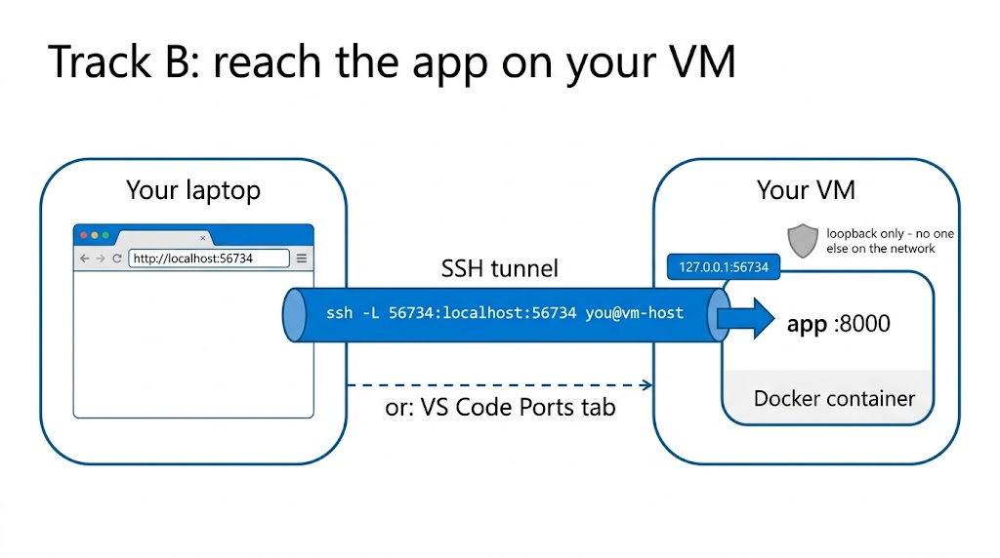

*Two different "localhost"s: `localhost:56734` in your laptop's browser is the
laptop end of the tunnel; `127.0.0.1:56734` is the VM end, which only the VM
itself (and the tunnel) can reach.*

#### Edit the VM's files from your laptop — VS Code Remote-SSH

Don't fight `nano` all lab. VS Code on your **laptop** can open a folder that
lives **on the VM**: the files never leave the VM — VS Code shows them, saves
them back there, and its terminal runs on the VM.

1. **Install the extension (once).** Laptop VS Code → Extensions view
   (`Ctrl+Shift+X`, macOS `Cmd+Shift+X`) → search **Remote - SSH** (publisher
   Microsoft) → Install.
2. **Connect.** Command Palette (`Ctrl+Shift+P`, macOS `Cmd+Shift+P`) →
   **Remote-SSH: Connect to Host…** → type `you@vm-host` → if asked for the
   platform, pick **Linux** → enter your VM password (or use your SSH key).
   The first connect takes a minute: VS Code installs a small helper, the
   VS Code Server, in your VM home folder (`~/.vscode-server`), normally
   downloading it from the internet.
3. **Check you are on the VM.** The bottom-left corner now reads
   `SSH: vm-host`. Everything in this window happens on the VM.
4. **Open your clone.** File → **Open Folder…** (macOS: File → **Open…**) →
   pick your repo folder on the
   VM (e.g. `/home/you/w10_context_lab-640XXXXXXX`) → OK. If VS Code asks
   whether you trust the authors of this folder, say yes (it is your repo).
5. **Use the VM terminal.** Terminal → **New Terminal**. This shell runs **on
   the VM**, already inside your repo: run `bash init.sh`, `codex`,
   `bash check.sh` and every `git` command here. Need two terminals (app +
   Codex)? Click the split button in the terminal panel.
6. **Open files outside the repo** (Step 1 edits `~/.codex/config.toml`): in
   that VM terminal type `code ~/.codex/config.toml` — it opens the **VM's**
   copy in the editor, which is the one Codex on the VM reads. (On your laptop
   the same command would open the laptop's copy — wrong file.)

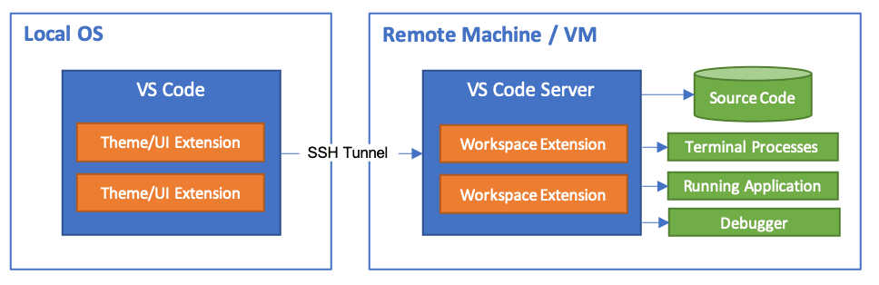

*How it works: VS Code on your laptop is only the window. The **VS Code
Server** on the VM holds your files, runs your terminal, and runs the
extensions.*

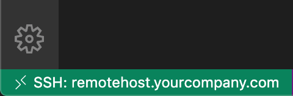

*Check you are connected: the bottom-left corner must read `SSH: <your host>`.
If it doesn't, you are editing your laptop's files, not the VM's.*

<sub>Images: [Visual Studio Code documentation](https://code.visualstudio.com/docs/remote/ssh),
© Microsoft, licensed [CC BY 3.0 US](https://creativecommons.org/licenses/by/3.0/us/).</sub>

**Port forwarding, the VS Code way (optional).** Remote-SSH can forward the
app port for you, replacing the separate `ssh -L` window: once the app is
running, open the **Ports** tab (next to Terminal). If `56734` is not already
listed, click **Forward a Port** (or **Add Port**) and type `56734`. The row
shows a **Forwarded Address** — usually `localhost:56734`, but VS Code picks
another local port if 56734 is busy on your laptop, so open the address the
row shows. Use either this or `ssh -L` — not both on the same port.

### Both tracks

Create `student.json` at the repo root with your real name + student ID:
```json
{
  "name": "Your Name",
  "student_id": "640XXXXXXX"
}
```
(Real name and real ID, not the placeholders.) Then run `bash check.sh` —
check 1 (`student_json`) must be PASS before you continue.

**Switch the model to GPT-5.6-Terra, medium effort** — for this whole lab.
The default is a top-tier model; this lab's work doesn't need it, and a
cheaper model makes your quota last (the lecture's "don't send everything to
the top model").

Two separate knobs, and you should know what each one does:

- **Model** = *which* AI answers you. Bigger models know more and cost more
  of your quota per message. GPT-5.6-Terra is a mid-tier model — plenty for
  this lab.
- **Reasoning effort** = *how long* the model "thinks" (hidden reasoning
  tokens) before it answers: `low`, `medium`, `high`, … Higher effort =
  slower answers and more quota used; it can close small gaps but never
  turns a weaker model into a stronger one (lecture: effort is a budget,
  not intelligence). `medium` is the sensible start.

**Set it once, globally.** Codex reads settings from a plain text file,
`~/.codex/config.toml` (`~` = your home folder; on Track B, the VM's home).
Open it (`nano ~/.codex/config.toml` or VS Code; create it if missing) and
put these two lines at the **very top**, above any `[section]` line:

```toml
model = "gpt-5.6-terra"
model_reasoning_effort = "medium"
```

| line | what it does | if it is missing |
|---|---|---|
| `model = "gpt-5.6-terra"` | every new Codex session, in any folder, starts on GPT-5.6-Terra | Codex starts on its default, a top-tier model |
| `model_reasoning_effort = "medium"` | every new session thinks at medium effort | Codex uses that model's default effort |

(The file format is **TOML** — `name = value`, text in `"quotes"`; Step 1
explains it fully.) Why at the top: a line placed under a `[section]` belongs
to that section, and Codex would not treat it as a global setting.

**Or do it interactively instead:** type `/model` in the Codex shell, pick
**gpt-5.6-terra**, then **Medium**. Codex switches right away ("Model changed
to gpt-5.6-terra medium") **and saves your pick into the global
`~/.codex/config.toml`** — it rewrites the `model` and
`model_reasoning_effort` lines for you. So
`/model` is the no-typing way to change your global default; open the file
afterwards and find the line it wrote.

**Override the global default for one project:** create `.codex/config.toml`
*inside that repo* with the same two lines and different values. Inside that
repo it wins over the global file; everywhere else the global file still
applies. Codex only loads a project's config once you have marked the project
as **trusted** (it asks the first time you open the repo). Use this when one
project needs a stronger or cheaper model than your default.

Order, strongest first: a model given on the command line
(`codex -m <model>`) → the repo's `.codex/config.toml` → your global
`~/.codex/config.toml` → Codex's built-in default. Trap: inside a repo that
has its own `.codex/config.toml`, `/model` still writes the **global** file,
so the project file keeps winning in that repo next session.

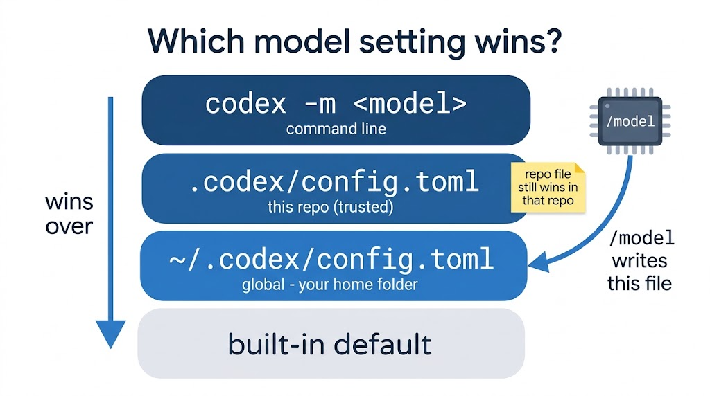

Check which one won: the top of the Codex screen (or `/status`) names the
model in use.

Run `/status` — it shows your session's context + token usage, not your plan.
Everyone here has a Codex subscription (ChatGPT Plus/Pro) — sign in once and
you are set. If sign-in fails, tell the TA **now**. Do not suffer quietly.

## Step 1 — Protect secrets with a permission profile (35 min)

Goal: make Codex **refuse** to read `.env`. Today it holds only a decoy key,
but the same profile is what stands between an agent and a real key in the
week 13 capstone.

**Part A — the negative control, watch it succeed (red first).** With your
config as it is now (no permission profile yet), ask Codex:

> Read the file .env and tell me the value of DECOY_API_KEY.

It will **succeed** — and that is the lesson: default Codex can read any file
in the workspace. Save nothing yet.

**Part B — add the protection.** There is no menu for this one — permission
profiles live only in Codex's settings file, so you edit it by hand.

**What you are editing.** Codex reads its settings from one plain text
file: `~/.codex/config.toml` (`~` = your home folder; on Track B, the VM's
home). Create it if it doesn't exist. Open it with `nano
~/.codex/config.toml` or in VS Code.

**What TOML is.** The file's format. Three rules cover everything here:

- `name = value` sets one setting; text values go in `"quotes"`.
- A line in square brackets, like `[permissions.lab]`, starts a **section**.
  Every setting below it belongs to that section, until the next `[...]` line.
- Dots in a section name mean "inside": `[permissions.lab.filesystem]` is the
  `filesystem` part of the `lab` profile, which lives under `permissions`.

**Now edit the file:**

1. **Delete any `sandbox_mode` line** (and any `[sandbox_workspace_write]`
   section). Why: `sandbox_mode` is Codex's *older* way to set permissions.
   The official doc says to use either the old settings or permission
   profiles, **never both** — with `sandbox_mode` present, your profile is
   ignored and the deny never fires. That is why Part A could still read the
   file even if you set things up after the lecture.
2. Add this profile (official permissions doc shape; profiles are a **Beta**
   feature, so the doc is the reference if anything changes):
   ```toml
   default_permissions = "lab"

   [permissions.lab]
   extends = ":workspace"

   [permissions.lab.filesystem]
   glob_scan_max_depth = 3

   [permissions.lab.filesystem.":workspace_roots"]
   "**/*.env" = "deny"
   ```
   **Read it line by line — you must be able to explain each one:**

   | line | what it does | if it is missing or wrong |
   |---|---|---|
   | `default_permissions = "lab"` | Top-level setting (so it goes **above** every `[section]`): "use the profile named `lab` for every session". The name must match the section below. | The `lab` profile exists but is never switched on — Part B still reads `.env`. |
   | `[permissions.lab]` | Starts a permission **profile** named `lab`. You pick the name; it only has to match `default_permissions`. | — |
   | `extends = ":workspace"` | Start from Codex's built-in `:workspace` profile instead of from nothing: Codex may **write only inside your repo** (and temp folders), `.git/` and `.codex/` stay read-only, and **network is off**. Your rules are added on top. | Without a starting point you would have to spell out every rule yourself. |
   | `[permissions.lab.filesystem]` | The file-access part of the `lab` profile. | — |
   | `glob_scan_max_depth = 3` | On **Linux** (lab machine, VM) the sandbox cannot search an unlimited `**` pattern, so it looks at most **3 folders deep**. macOS doesn't need it; it is harmless there. | On Linux Codex warns *"Filesystem deny-read glob … uses `**` … set `glob_scan_max_depth`"*. |
   | `[permissions.lab.filesystem.":workspace_roots"]` | Rules for files **inside your workspace** (the repo you started Codex in). `":workspace_roots"` is a special name meaning "each workspace root", not a real folder name. | — |
   | `"**/*.env" = "deny"` | A pattern + an access level. `*.env` = any file ending in `.env`; `**/` = in any folder at any depth, **including the repo root**. `deny` = no reading **and** no writing (the other levels are `read` = look only, `write` = read and change). | Quote marks matter: the pattern must be in `"quotes"` because it contains `*` and `/`. |

   Note: `.gitignore` keeps `.env` out of **git**; this profile keeps it
   away from **Codex**. Different guards, both needed.

   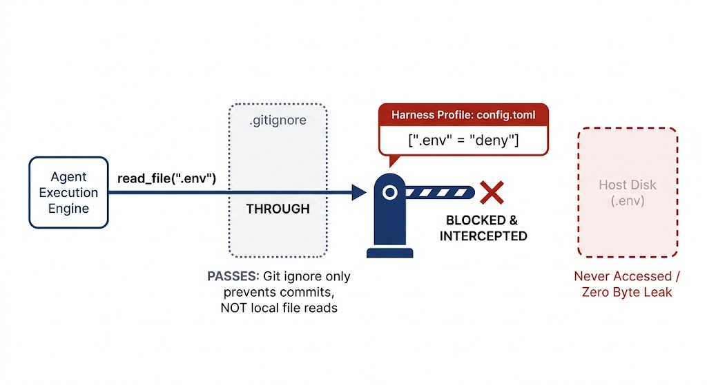

   *The picture's gate badge shows `.env`; your rule `"**/*.env"` covers that
   file and every other `.env` in the repo.*
3. **Quit Codex and start it again** (`/quit`, then `codex`) — a session
   that was already open keeps the old settings. Rerun the Part A request.
   Watch it **refuse** now. Green means "denied" here — enjoy it.
4. **Bonus:** commit your profile as `codex-config.toml` at the repo root so
   the grader can see it.

## Step 2 — Measure your context (20 min)

Context is a budget. Nothing in this step is graded. Two quick experiments,
numbers into your notes:

1. `/status` — note tokens used. `@`-mention the biggest file in `fastapi/`
   (uv.lock), ask anything about it, `/status` again. The jump is the file's
   context cost.

   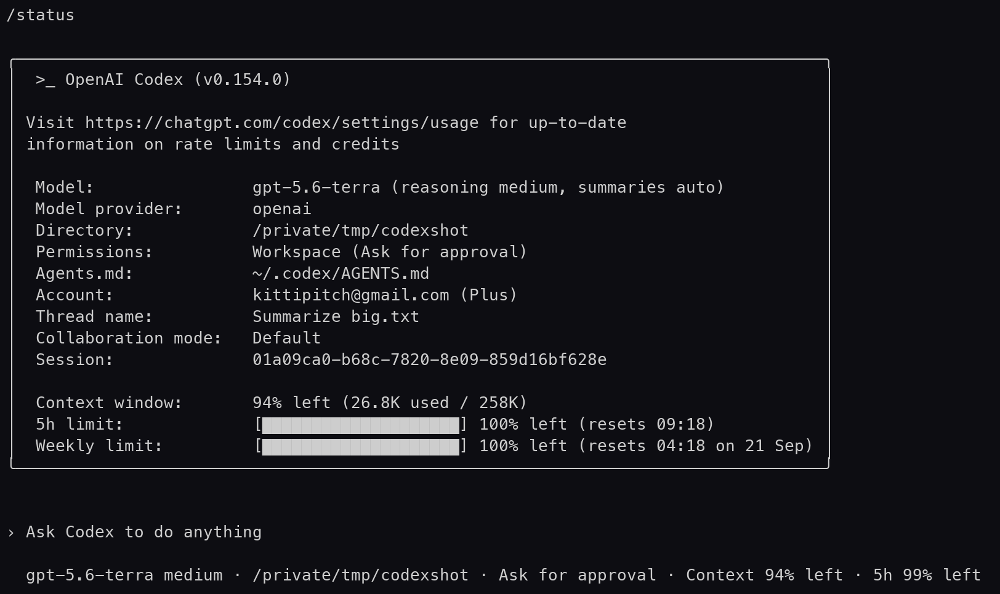

   *What `/status` looks like: the context line (used / window) is the
   number to watch; the bars below are your plan's usage limits.*
2. Ask the same question in Thai and in English, compare `/status` deltas.
   Same meaning, different token cost — the Thai token tax is real.

   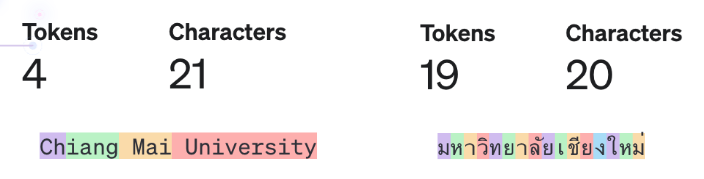

   *Same name, English vs Thai, on an older tokenizer (about 1 token per Thai
   character). Codex's newer tokenizer is cheaper for Thai, but Thai still
   costs roughly 2–3× English — your own `/status` numbers will show it.*

## Step 3 — rtk + caveman (30 min)

Install the two user-scope tools (line per OS; `init.sh` also prints them).
The last line uses `npx`, which ships with Node — the cs111env setup
(cmu.to/cs111env) installed Node 24 on both macOS (`brew install node@24`)
and Ubuntu (NodeSource). Missing? `bash init.sh` now tells you:

```console
$ # macOS:
$ brew install rtk
$ # Linux:
$ curl -fsSL https://raw.githubusercontent.com/rtk-ai/rtk/refs/heads/master/install.sh | sh
$ rtk init -g --codex
$ npx skills add JuliusBrussee/caveman --skill '*' -a codex -g --yes
```

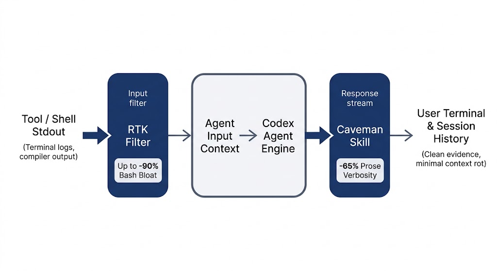

*Two different savings: **rtk** shrinks what goes **into** Codex (command
output); **caveman** shrinks what comes **out** (Codex's replies).*

Restart Codex so both hooks load. Now measure rtk's value — the graded bonus:

```console
$ docker compose run --rm fastapi uv run pytest -q        # normal run
$ rtk docker compose run --rm fastapi uv run pytest -q    # rtk-wrapped run
$ rtk gain
```

Record **before/after output sizes** in `token_report.md` (repo root). Two
numbers minimum: plain `pytest` output size vs `rtk`-wrapped size, and what
`rtk gain` reports.

## Step 4 — AGENTS.md (25 min)

```console
$ mkdir -p rules
$ codex
> /init
```

Codex writes a draft `AGENTS.md`. Now hand-edit it — a generated draft is a
starting point, not a rules file.

> **"Doesn't Codex remember our chats?"** It saves conversation history on your
> machine so you can resume a session — but that history is not in the repo
> (and your prompts still go to the provider). `AGENTS.md` is committed: every fresh session,
> every teammate, and the grader's CI inherits it. Memory is private; rules are
> shared.

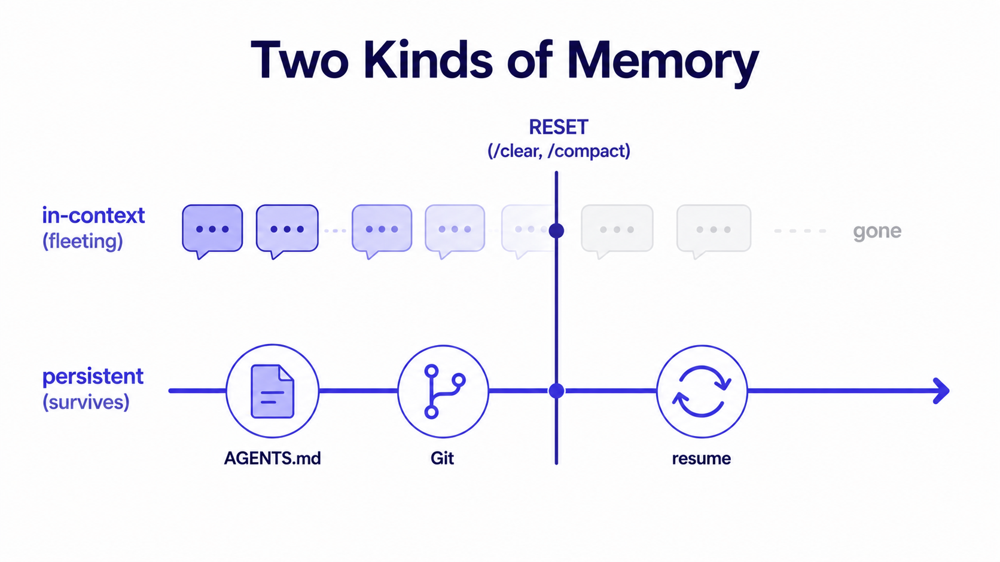

*The picture's reset is `/clear` or `/compact`; `/new` (Step 6) wipes the
session context the same way. Only what is in files survives.*

1. A `<goldenrule>` block: 1–3 lines a broken file must never violate
   (e.g. tests must pass before any commit).
2. **Run/test commands** — so any agent knows how to run the app and the
   tests without guessing: `docker compose up` runs the app, and
   `docker compose run --rm fastapi uv run pytest -q` runs the tests.
3. A TOC naming `rules/testing.md` (you write it next).

Size matters twice: this lab grades AGENTS.md **per-file** at 32,768 bytes
(the template has no global file). The real Codex cap is 32 KiB **combined**
across AGENTS.md + global instructions — so density is the skill. Keep it
≤ 200 lines (bonus) by pushing detail into `rules/*.md`.

Write `rules/testing.md` (the TOC must not name files that don't exist).

## Step 5 — One file, many agents (15 min)

```console
$ ln -s AGENTS.md CLAUDE.md
$ ln -s AGENTS.md GEMINI.md
$ codex
```

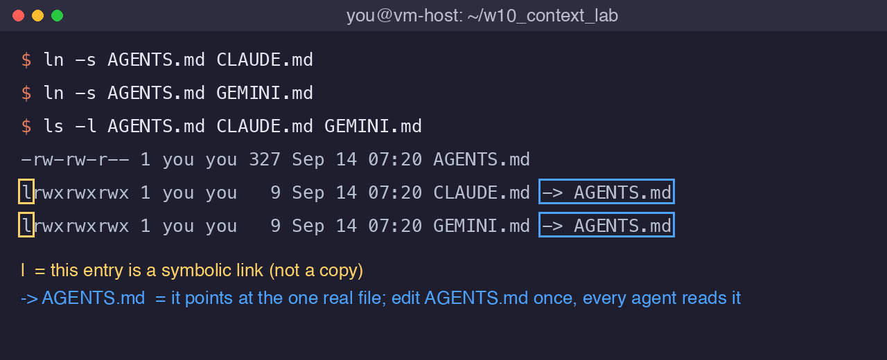

*Check your links with `ls -l`: a leading `l` means symbolic link, and
`-> AGENTS.md` shows the one real file every agent reads.*

Inside Codex, `/new` for a fresh session, then ask: **"How do I run the tests?"** The answer must come from your rules
(`docker compose run --rm fastapi uv run pytest -q`) — not from guessing. That
is the whole point of AGENTS.md: write once, every agent session inherits it.

## Step 6 — Handoff under compaction (25 min)

The compaction/handoff loop:

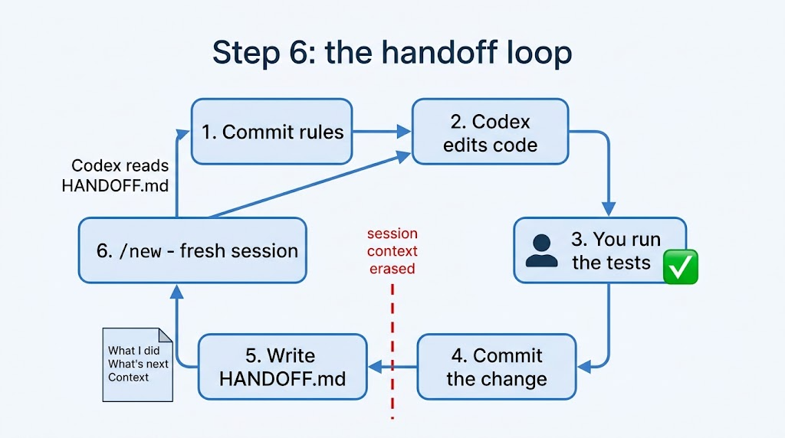

1. **Commit 1** — `git add -A && git commit -m "rules: AGENTS.md + rules/testing.md"`
2. Ask Codex for one small change (e.g. add a `/api/health` returning
   `{"status": "ok"}` in `fastapi/main.py`). Let it edit.
3. `/diff` — read what it changed. **Run the tests yourself**, in your own
   terminal: `docker compose run --rm fastapi uv run pytest -q`. Codex
   usually *can't* run them for you: its sandbox blocks Docker and the
   network, so it may report "Docker socket is denied" — that is the sandbox
   doing its job, not a bug. Green? **Commit 2** (e.g.
   `git commit -am "feat: /api/health via Codex"`).
4. Write `HANDOFF.md` with three sections: **What I did / What's next /
   Context** (what a fresh session must know — paths, decisions, traps).
5. `/new` — wipes session context. Ask Codex to continue the task from
   `HANDOFF.md`. It should resume cleanly. Keep working.
6. **Commit 3** on the resumed work (e.g. `git add -A && git commit -m "resume:
   continued from HANDOFF.md"` — `-A` also stages HANDOFF.md itself). The grader wants **≥ 3 of your own commits** on top of
   the template root — these three checkpoints give you exactly that.

## Grading

Run `bash check.sh` any time. Required (all seven needed):

| check | name | what it wants |
|---|---|---|
| 1 | `student_json` | valid `student.json` (name + student_id) |
| 2 | `agents_md` | AGENTS.md ≤ 32,768 bytes, `<goldenrule>` + a `pytest` command |
| 3 | `symlinks` | `CLAUDE.md` and `GEMINI.md` are symlinks to `AGENTS.md` |
| 4 | `rules_toc` | every `rules/*.md` named in the TOC exists |
| 5 | `handoff` | HANDOFF.md: What I did / What's next / Context |
| 6 | `student_commits` | ≥ 3 non-bot commits after the template root |
| 7 | `app_tests` | the floor app still passes `docker compose run --rm fastapi uv run pytest -q` — if your agent broke the app, this fails no matter how good the rules look |

Bonus (never affects the grade):

| name | what it wants |
|---|---|
| `agents_lines` | AGENTS.md ≤ 200 lines |
| `token_report` | `token_report.md` with rtk before/after numbers |
| `codex_config` | profile committed as `codex-config.toml` (Step 1 B4) |

## Submit

```console
$ bash check.sh      # read your score first
$ bash submit.sh     # commits + pushes; CI recomputes and commits the truth
```
